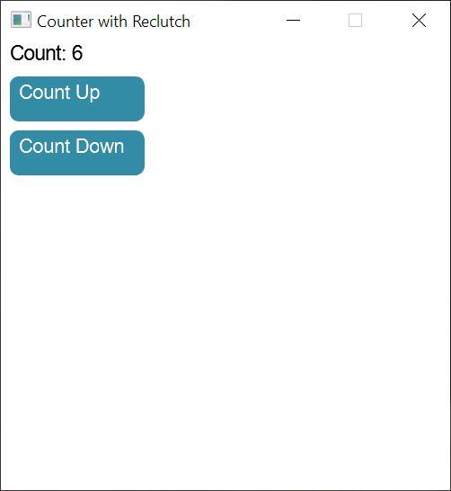

<p align="left">
    
</p>

## Gain control of your UI again

[](https://travis-ci.com/jazzfool/reclutch)

* [Events and event queues](event/README.md)

## Features

- Barebones (i.e. no widget toolkit or layout library provided).
- Retained-mode rendering.
- Object-oriented widgets in idiomatic Rust.
- Renderer-agnostic.

There is an (optional) OpenGL Skia implementation for the renderer.

## Example

All rendering details have been excluded for simplicity.

```rust
#[derive(WidgetChildren)]
struct Button {
    pub button_press: RcEventQueue<()>,
    global_listener: RcEventListener<WindowEvent>,
}

impl Button {
    pub fn new(global: &mut RcEventQueue<WindowEvent>) -> Self {
        Button {
            button_press: RcEventQueue::new(),
            global_listener: global.listen(),
        }
    }
}

impl Widget for Button {
    pub fn bounds(&self) -> Rect { /* --snip-- */ }

    pub fn update(&mut self, _aux: &mut ()) {
        for event in self.global_listener.peek() {
            match event {
                WindowEvent::OnClick(_) => self.button_press.push(()),
                _ => (),
            }
        }
    }

    pub fn draw(&mut self, display: &mut dyn GraphicsDisplay) { /* --snip-- */ }
}
```

The classic counter example can be found in examples/overview.

---



## Children

Children are stored manually by the implementing widget type.

```rust
#[derive(WidgetChildren)]
struct ExampleWidget {
    #[widget_child]
    child: AnotherWidget,
}
```

Which expands to...

```rust
impl reclutch::WidgetChildren for ExampleWidget {
    fn children(&self) -> Vec<&dyn Widget> {
        vec![&self.child]
    }

    fn children_mut(&mut self) -> Vec<&mut dyn Widget> {
        vec![&mut self.child]
    }
}
```

Then all the other functions (`draw`, `update`, maybe even `bounds` for parent clipping) are propagated manually (or your API can have a function which automatically and recursively invokes for both parent and child);

```rust
fn draw(&mut self, display: &mut dyn GraphicsDisplay) {
    // do our own rendering here...

    // ...then propagate to children
    for child in self.children_mut() {
        child.draw(display);
    }
}
```

**Note:** `Widget` requires that `WidgetChildren` is implemented.

The derive functionality is a feature, enabled by default.

## Rendering

Rendering is done through "command groups". It's designed in a way that both a retained-mode renderer (e.g. WebRender) and an immediate-mode renderer (Direct2D, Skia, Cairo) can be implemented.

```rust
struct VisualWidget {
    command_group: Option<CommandGroupHandle>,
}

impl Widget for VisualWidget {
    // --snip--

    // Draws a nice red rectangle.
    fn draw(&mut self, display: &mut dyn GraphicsDisplay) {
        // If self.command_group is `None` then `display.push_command_group` otherwise `display.modify_command_group`.
        ok_or_push(&mut self.command_group, display, &[
            DisplayCommand::Item(DisplayItem::Graphics(GraphicsDisplayItem::Rectangle {
                rect: Rect::new(Point::new(10.0, 10.0), Size::new(30.0, 50.0)),
                paint: GraphicsDisplayPaint::Fill(StyleColor::Color(Color::new(1.0, 0.0, 0.0, 1.0))),
            })),
        ]);

        draw_children();
    }

    // --snip--
}
```

## Updating

The `update` method on widgets is an opportunity for widgets to update layout, animations, etc. and more importantly handle events that have been emitted since the last `update`.

Widgets have a generic type; `Aux`, which is by default simply `()` which allows for a global object to be passed around during updating. This is useful for things like updating a layout.

Here's a simple example;

```rust
fn update(&mut self, aux: &mut Globals) {
    if aux.layout.node_is_dirty(self.layout_node) {
        self.bounds = aux.layout.get_node(self.layout_node);
        self.command_group.repaint();
    }

    self.update_animations(aux.delta_time());

    // propagation is done manually
    for child in self.children_mut() {
        child.update(aux);
    }

    // if your UI doesn't update constantly, then you must check child events *after* propagation,
    // but if it does update constantly, then it's more of a micro-optimization, since any missed events
    // will come back around next update.
    for press_event in self.button_press_listener.peek() {
        self.on_button_press(press_event);
    }
}
```
