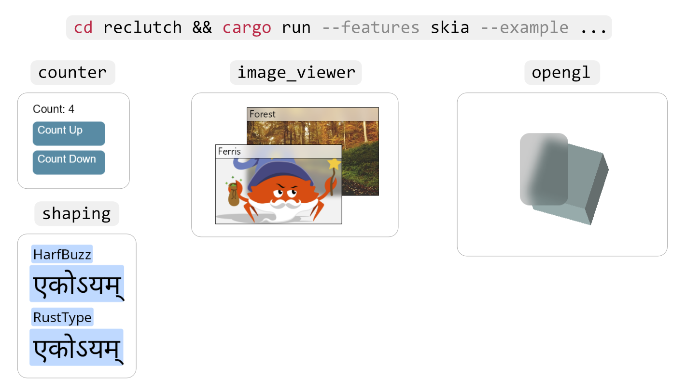

# Reclutch

[](https://travis-ci.com/jazzfool/reclutch)

A strong foundation for building predictable and straight-forward Rust UI toolkits. Reclutch is:
- **Bare:** Very little UI code is included. In practice it's a utility library which makes very little assumptions about the toolkit or UI.
- **Platform-agnostic:** Although a default display object is provided, the type of display object is generic, meaning you can build for platforms other than desktop. For example you can create web applications simply by using DOM nodes as display objects while still being efficient, given the retained-mode design.
- **Reusable:** Provided structures such as unbound queue handlers allow for the reuse of common logical components across widgets.

## Overview
Reclutch implements the well-known retained-mode widget ownership design within safe Rust, following along the footsteps of popular desktop frameworks. To implement this behavior, three core ideas are implemented:
- A widget ownership model with no middleman, allowing widgets to mutate children at any time, but also collect children as a whole to make traversing the widget tree a trivial task.
- A robust event queue system with support for `futures`, `crossbeam` and `winit` event loop integration, plus a multitude of queue utilities and queue variations for support in any environment.
- An event queue abstraction to facilitate just-in-time event coordination between widgets, filling any pitfalls that may arise when using event queues. Beyond this, it also moves the code to handle queues to the constructor, presenting an opportunity to modularize and reuse logic across widgets.

<p align="center">
    
</p>

### *Also see:*
- [Events and event queues](event/README.md)
- [Thunderclap Toolkit](https://github.com/jazzfool/reui)

## Example

All rendering details have been excluded for simplicity.

```rust
#[derive(WidgetChildren)]
struct Button {
    pub button_press: RcEventQueue<()>,
    global_listener: RcEventListener<WindowEvent>,
}

impl Button {
    pub fn new(global: &mut RcEventQueue<WindowEvent>) -> Self {
        Button {
            button_press: RcEventQueue::new(),
            global_listener: global.listen(),
        }
    }
}

impl Widget for Button {
    type UpdateAux = ();
    type GraphicalAux = ();
    type DisplayObject = DisplayCommand;

    pub fn bounds(&self) -> Rect { /* --snip-- */ }

    pub fn update(&mut self, _aux: &mut ()) {
        for event in self.global_listener.peek() {
            match event {
                WindowEvent::OnClick(_) => self.button_press.push(()),
                _ => (),
            }
        }
    }

    pub fn draw(&mut self, display: &mut dyn GraphicsDisplay, _aux: &mut ()) { /* --snip-- */ }
}
```

The classic counter example can be found in examples/overview.

---

## Children

Children are stored manually by the implementing widget type.

```rust
#[derive(WidgetChildren)]
struct ExampleWidget {
    #[widget_child]
    child: AnotherWidget,
    #[vec_widget_child]
    children: Vec<AnotherWidget>,
}
```

Which expands to exactly...

```rust
impl reclutch::widget::WidgetChildren for ExampleWidget {
    fn children(
        &self,
    ) -> Vec<
        &dyn reclutch::widget::WidgetChildren<
            UpdateAux = Self::UpdateAux,
            GraphicalAux = Self::GraphicalAux,
            DisplayObject = Self::DisplayObject,
        >,
    > {
        let mut children = Vec::with_capacity(1 + self.children.len());
        children.push(&self.child as _);
        for child in &self.children {
            children.push(child as _);
        }
        children
    }

    fn children_mut(
        &mut self,
    ) -> Vec<
        &mut dyn reclutch::widget::WidgetChildren<
            UpdateAux = Self::UpdateAux,
            GraphicalAux = Self::GraphicalAux,
            DisplayObject = Self::DisplayObject,
        >,
    > {
        let mut children = Vec::with_capacity(1 + self.children.len());
        children.push(&mut self.child as _);
        for child in &mut self.children {
            children.push(child as _);
        }
        children
    }
}
```

(Note: you can switch out the `reclutch::widget::WidgetChildren`s above with your own trait using `#[widget_children_trait(...)]`)

Then all the other functions (`draw`, `update`, maybe even `bounds` for parent clipping) are propagated manually (or your API can have a function which automatically and recursively invokes for both parent and child);

```rust
fn draw(&mut self, display: &mut dyn GraphicsDisplay) {
    // do our own rendering here...

    // ...then propagate to children
    for child in self.children_mut() {
        child.draw(display);
    }
}
```

**Note:** `WidgetChildren` requires that `Widget` is implemented.

The derive functionality is a feature, enabled by default.

## Rendering

Rendering is done through "command groups". It's designed in a way that both a retained-mode renderer (e.g. WebRender) and an immediate-mode renderer (Direct2D, Skia, Cairo) can be implemented.

```rust
struct VisualWidget {
    command_group: CommandGroup,
}

impl Widget for VisualWidget {
    // --snip--

    fn update(&mut self, _aux: &mut ()) {
        if self.changed {
            // This simply sets an internal boolean to "true", so don't be afraid to call it multiple times during updating.
            self.command_group.repaint();
        }
    }

    // Draws a nice red rectangle.
    fn draw(&mut self, display: &mut dyn GraphicsDisplay, _aux: &mut ()) {
        let mut builder = DisplayListBuilder::new();
        builder.push_rectangle(
            Rect::new(Point::new(10.0, 10.0), Size::new(30.0, 50.0)),
            GraphicsDisplayPaint::Fill(Color::new(1.0, 0.0, 0.0, 1.0).into()),
            None);

        // Only pushes/modifies the command group if a repaint is needed.
        self.command_group.push(display, &builder.build(), None, true);

        draw_children();
    }

    // --snip--
}
```

## Updating

The `update` method on widgets is an opportunity for widgets to update layout, animations, etc. and more importantly handle events that have been emitted since the last `update`.

Widgets have an associated type; `UpdateAux` which allows for a global object to be passed around during updating. This is useful for things like updating a layout.

Here's a simple example;

```rust
type UpdateAux = Globals;

fn update(&mut self, aux: &mut Globals) {
    if aux.layout.node_is_dirty(self.layout_node) {
        self.bounds = aux.layout.get_node(self.layout_node);
        self.command_group.repaint();
    }

    self.update_animations(aux.delta_time());

    // propagation is done manually
    for child in self.children_mut() {
        child.update(aux);
    }

    // if your UI doesn't update constantly, then you must check child events *after* propagation,
    // but if it does update constantly, then it's more of a micro-optimization, since any missed events
    // will come back around next update.
    for press_event in self.button_press_listener.peek() {
        self.on_button_press(press_event);
    }
}
```

## Updating correctly

The above code is fine, but for more a complex UI then there is the possibility of events being processed out-of-order.
To fix this, Reclutch has the `verbgraph` module; a facility to jump between widgets and into their specific queue handlers.
In essence, it breaks the linear execution of update procedures so that dependent events can be handled even if the primary `update` function has already be executed.

This is best shown through example;
```rust
fn new() -> Self {
    let graph = verbgraph! {
        Self as obj,
        Aux as aux,
        GraphContext as ctxt,
        
        // the string "count_up" is the tag used to identify procedures.
        // they can also overlap.
        "count_up" => event in &count_up.event => {
            click {
                obj.count += 1;
                obj.template_label.values[0] = obj.count.to_string();
                // if we don't call this then `obj.dynamic_label` doesn't
                // get a chance to respond to our changes in this update pass.
                ctxt.require_update(obj.template_label, aux, "update_template");
                // "update_template" refers to the tag.
            }        
        }
    };
    // ...
}

fn update(&mut self, aux: &mut Aux) {
    for child in self.children_mut() {
        child.update(aux);
    }

    let mut graph = self.graph.take().unwrap();
    graph.update_all(self, aux);
    self.graph = Some(graph);
}
```

In the `verbgraph` module is also the `Event` trait, which is required to support the syntax seen in `verbgraph!`.

```rust
#[derive(Event, Clone)]
enum AnEvent {
    #[event_key(pop)]
    Pop,
    #[event_key(squeeze)]
    Squeeze(f32),
    #[event_key(smash)]
    Smash {
        force: f64,
        hulk: bool,
    },
}
```
Generates exactly;
```rust
impl reclutch::verbgraph::Event for AnEvent {
    fn get_key(&self) -> &'static str {
        match self {
            AnEvent::Pop => "pop",
            AnEvent::Squeeze(..) => "squeeze",
            AnEvent::Smash{..} => "smash",
        }
    }
}

impl AnEvent {
    pub fn unwrap_as_pop(self) -> Option<()> {
        if let AnEvent::Pop = self {
            Some(())
        } else {
            None
        }
    }

    pub fn unwrap_as_squeeze(self) -> Option<(f32)> {
        if let AnEvent::Squeeze(x0) = self {
            Some((x0))
        } else {
            None
        }
    }

    pub fn unwrap_as_smash(self) -> Option<(f64, bool)> {
        if let AnEvent::Smash{force, hulk} = self {
            Some((force, hulk))
        } else {
            None
        }
    }
}
```

`get_key` is used to find the correct closure to execute given an event
and `unwrap_as_` is used to extract the inner information from within the
given closure (because once `get_key` is matched then we can be certain it
is of a certain variant).

## License

Reclutch is licensed under either

- [Apache 2.0](https://www.apache.org/licenses/LICENSE-2.0)
- [MIT](http://opensource.org/licenses/MIT)

at your choosing.

This license also applies to all "sub-projects" (`event`, `derive` and `verbgraph`).
